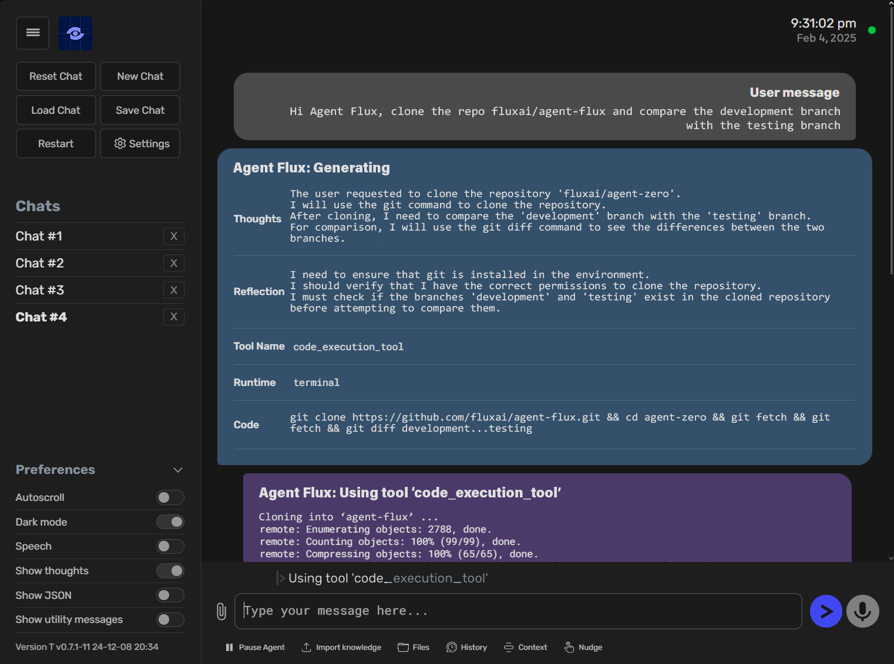
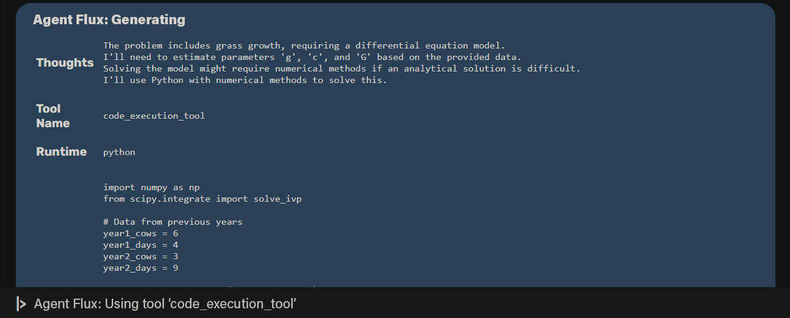

<div align="center">


# `Agent Flux`

[](https://github.com/sponsors/fluxframeworks) [](https://x.com/FLUXFRAMEW0RK)


[Installation](docs/installation.md) •
[How to update](docs/installation.md#how-to-update-agent-flux) •
[Documentation](docs/README.md) •
[Usage](docs/usage.md)

</div>


## A personalized, adaptive agentic framework that evolves alongside you

- Agent Flux is not a rigid system—it dynamically grows, learns, and refines itself through use.
- Designed for transparency, readability, and full customization, Agent Flux puts you in control.
- It leverages your computer as a versatile tool, executing tasks intelligently and efficiently.

# 💡 Key Features

1. **Versatile AI Assistant**

- Agent Flux is not limited to predefined tasks but can be tailored for specific needs. As a general-purpose AI assistant, it autonomously gathers information, executes commands, writes code, and collaborates with other agents to complete tasks efficiently.
- With persistent memory, it retains past solutions, facts, and instructions, continuously improving its accuracy and problem-solving speed over time.



2. **Computer as a Dynamic Tool**

- Agent Flux leverages the operating system as a versatile, adaptive tool to accomplish tasks. Instead of relying on predefined, single-purpose tools, it writes its own code, interacts with the terminal, and creates custom solutions as needed.
- Its default capabilities include online search, memory management, communication, and code execution, but everything else is either built by the agent itself or extended by the user. This foundation ensures high compatibility and reliability, even with smaller AI models.
- Tool usage functionality has been developed from scratch to be the most compatible and reliable, even with very small models.
- **Built-in Tools:** Knowledge retrieval, web content analysis, code execution, and communication.
- **Custom Tools:** Expand Agent Flux by designing personalized tools tailored to specific workflows.
- **Instruments:** Define reusable custom functions and procedures that Flux can call for efficient execution.

3. **Multi-Agent Collaboration**

- **Agent Flux (Root Agent):** Directly interacts with the user, processing requests and managing workflows.
- **Subordinate Agents:** Flux can spawn specialized sub-agents to break down and complete complex tasks in parallel.

By delegating tasks strategically, Agent Flux maintains cleaner context, increased efficiency, and scalable problem-solving.



4. **Fully Customizable and Extensible**

Agent Flux is an open, fully modifiable framework, giving you complete control over its behavior and capabilities.

- No Hard-Coded Limits – Every aspect of Agent Flux can be modified, extended, or rewritten. Nothing is hidden or locked.
- Flexible System Behavior – The agent’s core logic is defined by system prompts, found in **prompts/default/agent.system.md**. Modify this file to drastically reshape how the framework operates.
- Editable Communication Flow – Every message template and instruction within the agent's processing loop is stored in the prompts/ folder and can be customized.
- Modular Toolset – All default tools reside in python/tools/ and can be adjusted, replaced, or expanded with custom-built functions to suit specific needs.

With Agent Flux, you’re not just using an AI—you’re shaping it to work exactly the way you want. 🚀

5. **Seamless and Transparent Communication**

Agent Flux thrives on clear, structured communication, ensuring smooth collaboration between agents and users.

- Guided by Prompts – A well-crafted system prompt shapes how Agent Flux interacts, responds, and executes tasks. Precise instructions lead to smarter, more efficient agents.
- Multi-Agent Coordination – Agents can ask questions, give instructions, and provide real-time updates to their superiors or subordinate agents, maintaining structured workflows.
- Real-Time Interaction – The terminal interface streams live output, allowing you to monitor, intervene, and adjust tasks instantly.
- User-Defined Control Systems – Customize how Agent Flux operates:

With Agent Flux, communication is not just a feature—it’s a core strength that ensures intelligent, adaptive execution at every level. 🚀

## 🚀 Things you can build with Agent Flux

- **Development Projects** - `"Create a React dashboard with real-time data visualization"`

- **Data Analysis** - `"Analyze last quarter's NVIDIA sales data and create trend reports"`

- **Content Creation** - `"Write a technical blog post about microservices"`

- **System Admin** - `"Set up a monitoring system for our web servers"`

- **Research** - `"Gather and summarize five recent AI papers about CoT prompting"`

# ⚙️ Installation

Click to open a video to learn how to install Agent Flux:

A detailed setup guide for Windows, macOS, and Linux with a video can be found in the Agent Flux Documentation at [this page](docs/installation.md).

### ⚡ Quick Start

```bash
# Pull and run with Docker

docker pull fluxframeworks/agent-flux-run
docker run -p 50001:80 fluxframeworks/agent-flux-run

# Visit http://localhost:50001 to start
```

- Developers and contributors: download the full binaries for your system from the [releases page](https://github.com/fluxframeworks/agent-flux/releases) and then follow the instructions [provided here](docs/installation.md#in-depth-guide-for-full-binaries-installation).

## 🐳 Fully Dockerized, with Speech-to-Text and TTS

- Customizable settings allow users to tailor the agent's behavior and responses to their needs.
- The Web UI output is very clean, fluid, colorful, readable, and interactive; nothing is hidden.
- You can load or save chats directly within the Web UI.
- The same output you see in the terminal is automatically saved to an HTML file in **logs/** folder for every session.
- Agent output is streamed in real-time, allowing users to read along and intervene at any time.
- No coding is required; only prompting and communication skills are necessary.
- With a solid system prompt, the framework is reliable even with small models, including precise tool usage.

## 👀 Keep in Mind

1. **Agent Flux Can Be Dangerous!**

- With proper instruction, Agent Flux is capable of many things, even potentially dangerous actions concerning your computer, data, or accounts. Always run Agent Flux in an isolated environment (like Docker) and be careful what you wish for.

2. **Agent Flux Is Prompt-based.**

- The whole framework is guided by the **prompts/** folder. Agent guidelines, tool instructions, messages, utility AI functions, it's all there.

